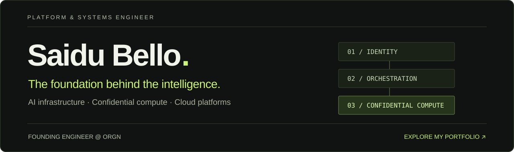

<samp><b>multi-cloud K8s fleet</b> &nbsp;·&nbsp; <b>~20k LOC Terraform</b> &nbsp;·&nbsp; <b>220+ LLMs routed</b> &nbsp;·&nbsp; <b>OAuth 2.1 IdP in prod</b> &nbsp;·&nbsp; <b>TDX attestation in Go</b></samp>

  

## About

I'm **Saidu** — a platform engineer who owns the whole path from `terraform plan` to production traffic.

I'm a founding engineer at **[ORGN](https://orgn.com)**, where we build a confidential-compute platform for AI development: hardware-isolated agent sandboxes on **Intel TDX**, an LLM gateway spanning **220+ models**, and the identity, billing, and observability planes that turn all of it into a product rather than a demo.

Nearly all of my work ships in **private org repos** — so instead of green squares, here are the receipts.

## Receipts, not vibes

### ☸️ &nbsp;Kubernetes & GitOps — the daily driver
- Operate a **multi-cloud fleet of production clusters** — GKE (Standard + Autopilot) and DigitalOcean — reconciled by **Argo CD app-of-apps**, hub-and-spoke, with CI-validated RBAC
- Scaled a Coder-based cloud development platform toward **1,000 concurrent developer workspaces**: quota math, warm node pools, DERP/WireGuard networking, auto-stop cost policies
- Executed a **zero-downtime blue-green migration** of a live OAuth identity provider (DigitalOcean + Neon → GKE + Cloud SQL), then decommissioned the old stack
- I root-cause the fun ones: Cloud NAT no-loopback silently killing cache invalidation, WireGuard MTU/conntrack resets against the K8s API, HPA-vs-GitOps self-heal fights

### 🏗️ &nbsp;Terraform & multi-cloud IaC
- **~20k lines of production HCL** across **GCP, DigitalOcean, and Alibaba Cloud**, plus Cloudflare zero-trust access
- Policy-as-code with **OPA/Rego** gates that understand plan semantics — block standalone deletes, allow-and-warn on replacements
- **Keyless CI/CD everywhere**: GitHub Actions → OIDC / Workload Identity Federation, zero long-lived cloud credentials
- Apply pipelines where the applied plan is **byte-identical to the reviewed one** — concurrency fencing, run-attempt rejection, explicit destroy attestation

### 🔐 &nbsp;Security & identity engineering
- Built and operate an **OAuth 2.1 / OIDC authorization server** powering SSO for a product suite — passkeys, org/team RBAC, metered Stripe billing, GitOps-delivered to GKE
- Zero-trust access architecture: **WireGuard + Teleport** identity-aware proxy with session recording and SOC2-oriented audit trails
- Led **external security-assessment remediation end-to-end** across four production services — every fix paired with a regression test, shipped through the same gated CI as feature work
- Details matter: hand-rolled IPv4/IPv6 CIDR trust-chain matching to fix a real rate-limit incident; capability-token git-credential delivery where secrets are returned once and stored only hashed

### 🛡️ &nbsp;Confidential computing
- **Intel TDX in production**: confidential GKE node pools, taint-isolated, scale-to-zero
- Designed and wrote a **per-sandbox remote-attestation service in Go** — node-local broker DaemonSet, public verification gateway, MRTD/RTMR quote decoding
- Extended **Trigger.dev** (internal fork) so every background-job run carries a hardware attestation bound to `SHA-512(runId:attempt)`
- Ship TEE-routed inference across **Intel SGX, Intel TDX, and NVIDIA Confidential Computing** providers

### 🦀 &nbsp;Rust & systems
- Billing engine for a high-throughput LLM gateway that stays **correct under stream cancellation** — Drop guards, reservation tokens, dark-launch rollout behind flags, thoroughly unit-tested
- **microVM networking**: added raw-socket modes (Linux TAP / macOS vmnet) to a libkrun-based sandbox so security tooling gets real L3 without privileged containers
- Distroless **axum** inference gateway behind Kubernetes Gateway API, tuned for hour-long SSE streams

### 🤖 &nbsp;AI / agent infrastructure
- LLM gateway routing **220+ models across 4 providers** — metering, spend caps, subscription rate-limit windows
- **Production remote MCP servers**: Streamable HTTP transport done right, plus a full OAuth 2.1 + PKCE authorization proxy so AI agents authenticate like first-class clients
- Sandbox orchestration at every layer: Daytona, E2B, libkrun microVMs, per-sandbox WireGuard egress isolation
- Founded and gatekeep a **~630k-LOC AI development platform monorepo** — 1,400+ of my commits, 15+ engineers, and the merge button is mine

### 📊 &nbsp;Observability & FinOps
- Prometheus · Grafana · Loki · Tempo · OpenTelemetry as defaults; **ClickHouse** for telemetry at volume; three-zone Grafana HA
- Live migration from ClickHouse Cloud to self-hosted on GKE — automated DDL rewriting, materialized-view-aware ordering, verified read-back
- Identified and executed **50%+ infrastructure cost reductions**: right-sizing, load-balancer consolidation, scale-to-zero pools, workspace auto-stop

## Stack

 

## How I work

- **GitOps everything** — if it isn't in git and reconciled, it doesn't exist
- **Keyless by default** — OIDC federation over exported credentials, every time
- **Tests as receipts** — security fixes, billing paths, and migrations all land with regression tests
- **Write it down** — migration plans, threat models, and runbooks before the change; honest postmortem notes after
- **Fail-open vs fail-closed is a decision, not an accident** — and it's documented at the call site

## GitHub numbers

> Most of my contributions live in private organization repos — the graphs below undercount by design.

<picture>
  <source media="(prefers-color-scheme: dark)" srcset="https://github-readme-stats.vercel.app/api?username=Pilgrim-Xzed&show_icons=true&count_private=true&include_all_commits=true&hide_border=true&theme=github_dark&bg_color=00000000"/>
  
</picture>
<picture>
  <source media="(prefers-color-scheme: dark)" srcset="https://streak-stats.demolab.com?user=Pilgrim-Xzed&hide_border=true&theme=github-dark-blue&background=00000000"/>
  
</picture>

<picture>
  <source media="(prefers-color-scheme: dark)" srcset="https://raw.githubusercontent.com/Pilgrim-Xzed/Pilgrim-Xzed/output/github-contribution-grid-snake-dark.svg"/>
  
</picture>

## Let's talk

If you're building something where **infrastructure is the product** — AI platforms, developer tools, confidential computing, or anything where "it works on my machine" isn't good enough — I'd love to hear about it.

&nbsp;

  

